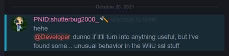

# SSSL - Hackless SSL bypass for the Wii U

	
	 
	 

On March 1, 2021 Nintendo released Wii U firmware version [5.5.5](https://wiiubrew.org/wiki/5.5.5). This update updated the Wii U's SSL verification and recompiled all RPLs (though no code changes were made). The exact purpose for this update is unknown, as nothing of significance was changed, and no other changes were made in this update. With the changes to SSL verification, Nintendo introduced a bug which allows for the forging of SSL certificates. These forged certificates will be seen as "Nintendo Signed" and, due to an existing bug with how the Wii U handles CA common names, will be accepted by all domains.

## The bugs

There are 2 bugs at play:

1. Normally a CA common name does not accept a single wildcard (\*) value. They must contain a hostname, and optionally one or many wildcards for subdomains. The Wii U will accept a single \* wildcard in place of a hostname, which allows the CA to be accepted as any domain. This bug has existed since before 5.5.5, but was not useful until now.
2. As of 5.5.5, CA's crafted in a specific way may take a newly introduced alternate path for verification. This allows for a CA's signature to not be verified correctly. Instead, the Wii U simply checks if the CA matches one already known by the system, but not the signature or contents of the CA. We have no idea why this change was made, as it does not benefit Nintendo at all. It almost feels intentional.

## Exploiting

Not any CA will work. There are 3 conditions for a CA which still need to be met even for a forged CA to be accepted:

1. The CA needs to be one which the Wii U would already accept. The signature is not validated in this case, so modifying an existing CA works.
2. The Wii U does not allow a Root CA in the cert chain. It will ignore any certs that have a matching subject and authority key.
3. The title must not roll it's own SSL. WebKit titles such as the eShop, Miiverse, TVii, etc, as well as any game which uses it's own SSL library, will not work with these certificates.

The easiest way to exploit this bug is to use the Nintendo CA - G3 CA, and is what this script opts to do. This can be dumped from a Wii U's SSL certificates title at `/storage_mlc/sys/title/0005001b/10054000/content/scerts/CACERT_NINTENDO_CA_G3.der`. Changing the public key to a user-controlled key and changing the authority key identifier to anything else is all that is required. The resulting user-controlled private key and patched CA can be used to bypass SSL verification without any homebrew or CFW at all.

## The script

This script takes in a copy of the Nintendo CA - G3 (in either DER or PEM format), does the above patches, and exports the patched CA and private key.

1. Install [NodeJS](https://nodejs.org/)
2. `git clone https://github.com/PretendoNetwork/SSSL.git`
3. `cd SSSL`
4. `npm i` to install the dependencies
5. `node patch` to use environment variables or `node patch -i` to interactively prompt for all configuration values

## Docker

This script can also be run in a Docker container.

1. `git clone https://github.com/PretendoNetwork/SSSL`
2. `cd SSSL`
3. `docker build . -t sssl`
4. `docker run -it --rm -v .:/app sssl` or `docker run -it --rm -v .:/app sssl -i`

## Configuration

This script can be configured using environment variables, a `.env` file, or individual command-line arguments. Alternatively, it can be run with the `-i` or `--interactive` flag to interactively prompt for all configuration values. Command-line arguments always override environment variables.

| Environment Variable       | Command-line Argument                   | Description                                                         | Default                       |
| -------------------------- | --------------------------------------- | ------------------------------------------------------------------- | ----------------------------- |
| N/A                        | `-i`, `--interactive`                   | Interactively prompt for all configuration values                   | N/A                           |
| SSSL_NINTENDO_CA_G3_PATH   | `-g`, `--nintendo_g3_path <value>`      | Path to Nintendo CA - G3 certificate (may be in DER or PEM format)  | `./CACERT_NINTENDO_CA_G3.der` |
| SSSL_NINTENDO_CA_G3_FORMAT | `-f`, `--nintendo_g3_format <value>`    | Nintendo CA - G3 certificate format (must be "der" or "pem")        | `der`                         |
| SSSL_CA_PRIVATE_KEY_PATH   | `-c`, `--ca_private_key_path <value>`   | Path to private key for forged CA (will generate if not set)        | N/A                           |
| SSSL_SITE_PRIVATE_KEY_PATH | `-s`, `--site_private_key_path <value>` | Path to private key for site certificate (will generate if not set) | N/A                           |
| SSSL_CSR_PATH              | `-r`, `--csr_path <value>`              | Path to CSR (will generate if not set)                              | N/A                           |
| SSSL_COMMON_NAME           | `-n`, `--common_name <value>`           | CN for site certificate (see [the bugs](#the-bugs))                 | `*`                           |
| SSSL_OUTPUT_FOLDER_PATH    | `-o`, `--out <value>`                   | Output folder                                                       | `./`                          |

## Credits

- Shutterbug for actually finding the new verification bug
- Jemma and Quarky for decompiling the updated SSL functions
